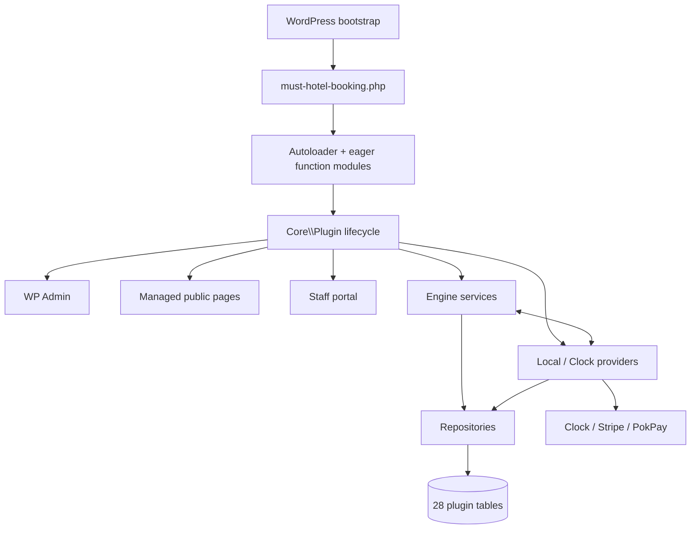

# Architecture

## Evidence baseline

This describes current `main` at `dcff3b4` / `v0.4.90`. It is a runtime navigation guide, not proof that production configuration or data matches a fresh install.

## Runtime overview

The desired conceptual direction is surfaces → engines/providers → repositories → database. Current code is not strictly layered: Core initializes every layer, Provider code calls Engine services, Engine code calls Provider services, and Portal code reuses some Admin actions/data providers.

## Bootstrap and loading

### `must-hotel-booking.php`

- Declares plugin metadata and version `0.4.90`.
- Defines path, URL, basename, slug, updater repository/branch/token and release-asset constants.
- Loads `includes/autoloader.php` and `includes/config.php`.
- Boots `BookingPerformanceMonitor` early.
- Registers activation/deactivation hooks.
- Runs database upgrade at `plugins_loaded` priority 5, then `Plugin::initPlugin()`.

### Class and function loading

- `includes/autoloader.php` maps `MustHotelBooking\` classes to `src/<Namespace>.php`.
- `includes/config.php` creates legacy `MustBookingConfig` aliases, loads `src/legacy-functions.php`, and eagerly includes top-level PHP files in Core, Database, Admin, Frontend, Engine and Elementor.
- Provider and Portal classes are normally autoloaded rather than eagerly included.
- Eager loading is required for namespaced function files that register hooks at file scope. Do not replace it with class autoloading without a hook/function compatibility plan.

### Plugin lifecycle

`src/Core/Plugin.php` owns the high-level lifecycle.

Activation:

1. Runs the table installer.
2. Migrates payment-policy defaults.
3. Runs the default inventory-unit backfill service.
4. Installs managed pages and synchronizes staff capabilities.
5. Schedules lock, provider-job and Clock sync cron hooks.
6. Registers portal rewrite rules and flushes rewrites.

Normal initialization:

- Rechecks inventory backfill and payment-policy migration.
- Repairs managed pages and staff capabilities.
- Boots the updater, provider registry, support widget/diagnostics, activity logger, public callback URL filters, locks, jobs, Clock scheduler, payment routes, Clock accounting/inbound sync, availability AJAX, email, portal, and Clock WBE frontend.
- Fires `must_hotel_booking/init`.

Deactivation unschedules plugin cron hooks and flushes rewrite rules. It does not delete data.

## Major directories and ownership

| Path | Current responsibility |
| --- | --- |
| `src/Core` | Lifecycle, settings, managed pages, status vocabulary, staff roles/capabilities, updater, diagnostics, room view/catalog helpers, activity/performance logging. |
| `src/Database` | Installer/current-version repair and domain repositories for reservations, payments, refunds, rooms, inventory, pricing, guests, housekeeping, reports and Clock accounting. |
| `src/Engine` | Availability, rules, locks, inventory, quote draft, pricing, reservation, booking status/lifecycle, payments, refunds, cancellations, amendments, coupons, email and abuse protection. |
| `src/Provider` | Provider contracts/registry, Local and Clock adapters, DTOs, mappings, request logs, sync jobs, schedulers and reconciliation. |
| `src/Admin` | WordPress admin menus, renderers, actions, queries, data providers, settings, diagnostics, import/export and reports. |
| `src/Frontend` | Managed-page request parsing, view data, booking selection, checkout, confirmation, formatting and Clock WBE integration. |
| `src/Portal` | Staff portal routing, authentication, access guard, module registry, controller and renderer. |
| `src/Elementor` | Widget classes and hook/asset registration. Uppercase class files and lowercase registration files are both active. |
| `frontend/templates` | Public, staff-login, staff-shell and portal module templates. |
| `assets` | Scoped CSS, JavaScript, icons and images for public/admin/portal/widgets. |
| `lib/plugin-update-checker` | Bundled third-party updater library. |
| `tests` | Standalone PHP tests and guarded E2E harness. There is no Composer/PHPUnit runner. |
| `tools` | Release, diagnostics, backup, settings, cleanup and smoke-test scripts with different side-effect boundaries. |

## Domain and service boundaries

| Domain | Primary services | Persistence |
| --- | --- | --- |
| Availability and restrictions | `AvailabilityEngine`, `AvailabilityRulesService`, provider availability adapters | `AvailabilityRepository`, reservation/inventory reads |
| Inventory and locks | `InventoryEngine`, `LockEngine` | `InventoryRepository`, `mhb_rooms`, `mhb_inventory_locks` |
| Pricing and quote | `PricingEngine`, `RatePlanEngine`, `BookingQuoteDraft`, provider quote adapters | Pricing/rate-plan repositories plus signed selection transient |
| Reservations | `ReservationEngine`, provider reservation adapters, `BookingLifecycleSyncService`, `BookingStatusEngine` | `ReservationRepository` |
| Payments | `PaymentEngine`, gateway implementations, `PaymentStatusService`, `PaymentProviderFeeService` | `PaymentRepository` |
| Refunds/cancellation | `PaymentRefundService`, `CancellationEngine`, `CancellationFinancialCleanupService` | `RefundRepository`, reservation metadata |
| Amendments | `ReservationAmendmentService`, `ClockReservationAmendmentService` | Reservation repository, provider jobs/metadata |
| Clock accounting | `ClockPaymentAccountingService`, folio/reconciliation services | `ClockFolioAccountingRepository`, provider jobs/logs |
| Email | `EmailEngine`, `EmailLayoutEngine` | Settings and activity log; delivery through `wp_mail()` |

Repository singletons are exposed by namespaced helper functions in `src/Engine/01-repositories.php`. This is a current compatibility boundary.

## Database model

### Installation and upgrade

- `src/Database/install-tables.php` declares 28 `dbDelta()` table definitions.
- `must_hotel_booking_db_version` stores the plugin version, not an independent numbered schema sequence.
- When the stored database version is lower than the plugin version, the full installer runs and then updates the option.
- When it is equal or higher, `Plugin::maybeUpgradeDatabase()` still runs `ensure_payment_release_schema()` to repair selected payment/refund/accounting columns and payment indexes.
- `AccommodationCategoryUpgradeService` runs after `dbDelta()`.
- No foreign keys were found. Relationships and delete/update safety are enforced in application code.
- Historical tables/columns must not be removed merely because their data is already migrated.

### Table ownership

| Group | Tables |
| --- | --- |
| Sellable catalogue | `must_room_categories`, `must_rooms`, `must_room_meta` |
| Physical inventory | `mhb_room_types`, `mhb_rooms`, `mhb_inventory_locks` |
| Housekeeping | `must_room_housekeeping_statuses`, `must_room_housekeeping_issues`, `must_housekeeping_handoffs` |
| Guests/reservations | `must_guests`, `must_reservations` |
| Pricing/availability | `must_pricing`, `must_availability`, `must_taxes`, `must_coupons` |
| Rate plans/seasons | `mhb_cancellation_policies`, `mhb_rate_plans`, `mhb_room_type_rate_plans`, `mhb_rate_plan_prices`, `mhb_seasons`, `mhb_seasonal_prices` |
| Money | `must_payments`, `must_refunds`, `must_clock_folio_accounting` |
| Audit/provider | `must_activity_log`, `mhb_provider_mappings`, `mhb_provider_request_logs`, `mhb_provider_sync_jobs` |

Key relationships:

- Reservation → guest via `guest_id`.
- Reservation → sellable room via `room_id`; provider/internal type via `room_type_id`; physical unit via `assigned_room_id`.
- Payment/refund/accounting rows link back to reservations and each other through IDs and external references.
- Provider mappings bind local entities to external IDs.
- JSON/text provider metadata carries pricing snapshots, cancellation financial state, Clock references, fulfillment flags and diagnostic context. Treat stored keys as compatibility contracts.

## WordPress entry points

### Managed public pages

`ManagedPages::getConfig()` defines:

| Setting | Default slug | Required/created |
| --- | --- | --- |
| `page_rooms_id` | `/rooms` | Optional; not auto-created |
| `page_booking_id` | `/booking` | Required; auto-created |
| `page_booking_accommodation_id` | `/booking-accommodation` | Required; auto-created |
| `page_checkout_id` | `/checkout` | Required; auto-created |
| `page_booking_confirmation_id` | `/booking-confirmation` | Required; auto-created |
| `portal_page_id` | `/staff` | Required when portal enabled; auto-created |
| `portal_login_page_id` | `/staff-login` | Required when portal enabled; auto-created |

No shortcode or block registration was found. Elementor widgets are optional entry components, but managed pages own the main flow.

### WordPress admin

Top-level menu: `must-hotel-booking`.

Visible pages: Dashboard, Reservations, Provider Logs, Calendar, Accommodations, Rates & Pricing, Availability Rules, Payments, Emails, Guests, Coupons, Reports and Settings.

Hidden pages: Reservation detail, Add Reservation, Rate Plans and Taxes & Fees.

Most pages require `manage_options`; Settings may use the configured staff settings capability with administrator override. Individual actions add capability and nonce checks.

### Staff portal

`PortalRegistry` defines nine modules:

- Dashboard
- Reservations
- Calendar
- Front Desk
- Guests
- Payments
- Housekeeping
- Rooms & Availability
- Reports

Deprecated route segments redirect:

- `quick-booking` → Front Desk / new booking
- `accommodations` → Rooms & Availability / rooms
- `availability-rules` → Rooms & Availability / rules

Module visibility is setting- and capability-dependent.

### REST routes

| Method and route | Owner | Public callback protection |
| --- | --- | --- |
| `POST must-hotel-booking/v1/stripe/webhook` | `PaymentEngine` | Stripe signature and server-side object/binding checks |
| `POST must-hotel-booking/v1/pokpay/finalize` | `PaymentEngine` | WordPress REST nonce plus stored order/reservation binding and provider fetch |
| `POST must-hotel-booking/v1/pokpay/error` | `PaymentEngine` | Diagnostic/error logging path |
| `POST must-hotel-booking/v1/pokpay/webhook` | `PaymentEngine` | Server-side provider order fetch/binding |
| `POST must-hotel-booking/v1/clock/webhook` | `ClockInboundSyncController` | AWS SNS signature or configured legacy auth; deduplication lock |
| `GET must-support/v1/health` | `SupportDiagnosticsEndpoint` | Disabled by default; opaque token; 404-style denial and no-cache headers |

The routes use public WordPress permission callbacks because provider/token authentication happens inside the callbacks. Do not remove internal verification.

### AJAX

Important AJAX actions include public/logged-in availability checks, disabled-date reads, accommodation selection, and authenticated admin/staff quick-booking actions. Preserve nonce/capability checks and `wp_ajax_nopriv_*` boundaries.

### Internal hooks

Durable domain hooks include:

- `must_hotel_booking/init`
- `must_hotel_booking/reservation_created`
- `must_hotel_booking/reservation_confirmed`
- `must_hotel_booking/reservation_cancelled`
- `must_hotel_booking/payment_recorded`
- `must_hotel_booking/email_dispatch_result`

Activity, email and Clock accounting listeners depend on these hooks. Idempotent status/payment writes must prevent duplicate side effects.

## Background work

The plugin uses WP-Cron, not Action Scheduler.

| Hook | Purpose |
| --- | --- |
| `must_hotel_booking_cleanup_expired_locks` | Five-minute lock cleanup and pending-payment expiration cleanup |
| `must_hotel_booking_process_provider_sync_jobs` | Five-minute provider job worker; one due job per bounded slice |
| `must_hotel_booking_clock_full_catalog_sync` | Daily Clock catalogue/mapping synchronization |
| `must_hotel_booking_clock_availability_rate_sync` | Configurable Clock availability/rate snapshot refresh |
| `must_hotel_booking_clock_reservation_fallback_sync` | Small fallback reservation refresh queueing |
| `must_hotel_booking_clock_auto_reservation_sync` | Legacy hook retained for cleanup/compatibility; current scheduler still reuses its runner logic |

Provider jobs have status, attempts, next-attempt timing, claims, stale-claim recovery and backoff. Pending post-payment Clock fulfillment is **not** currently queued through this job system.

## Configuration and runtime state

### Main settings

- Option: `must_hotel_booking_settings`.
- Grouped storage version: 6.
- Groups: general, booking rules, check-in/out, payments, staff access, branding, managed pages, notifications, provider and maintenance.
- `MustBookingConfig` normalizes defaults, nested storage and legacy top-level fields.

### Other important options/transients

- Database version and managed-page suspension.
- PokPay credential-verification state.
- Support diagnostics settings/token.
- Clock sync state, recent runs, snapshots and lock options.
- Provider worker option lock.
- Bounded booking performance diagnostics.
- Session-bound booking selection/quote transients.

Never document saved values or secrets. Configuration key names and safe meanings belong in `INTEGRATIONS.md` and `OPERATIONS.md`.

## Logging and diagnostics

- `must_activity_log`: reservation/payment/email/operational events.
- `mhb_provider_request_logs`: provider request lifecycle, correlation, sanitized summaries and errors.
- `must_clock_folio_accounting`: accounting/reconciliation evidence and reason codes.
- `mhb_provider_sync_jobs`: durable retry queue.
- Bounded options: Clock sync and booking performance timelines.
- Token-protected support-health JSON can include selected sanitized logs when explicitly enabled.

`ProviderDataSanitizer` recursively redacts known sensitive fields. Retention/pruning for provider and activity tables was not verified and remains an operational risk.

## Tests and release automation

- Tests are executable PHP files under `tests/`; many stub WordPress/provider behavior or scan source text.
- `tests/E2E` loads WordPress and can perform provider writes only behind explicit flags and readiness gates.
- `.github/workflows/release-package.yml` builds and validates the release archive. Current workflow does not run the PHP standalone suite or repository-wide PHP lint.
- `tools/release-plugin.ps1` mutates version/readme, pulls, tags, pushes and publishes; it is not a safe diagnostic command.

## Current architectural debt

1. Public confirmation access is not ownership-bound.
2. Confirmation/payment transitions lack one atomic authorization service on current `main`.
3. Paid provider outcome is not durable before post-payment Clock fulfillment.
4. Migration history is not independently versioned and critical tables lack database-enforced business uniqueness.
5. Some fallback/provider/portal files appear unused but require compatibility verification before removal.
6. Large controllers and cyclic dependencies complicate reliable testing.

Future cleanup is phased in `REPOSITORY_CONSOLIDATION_PLAN.md`; current runtime behavior must not be changed during documentation work.
