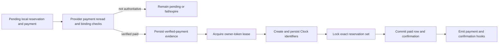

# Domain Lifecycles

This document describes current `main` behavior at `v0.4.90`. It separates verified implementation from intended invariants and known defects. Source code remains authoritative when behavior changes.

## Authorities and identifiers

| Concern | Authority in local mode | Authority in Clock mode | Traceability |
|---|---|---|---|
| Website content and presentation | WordPress/plugin database | WordPress/plugin database | Local accommodation, room, page, and media IDs |
| Search inventory and restrictions | Local rooms, reservations, restrictions, and locks | Clock live availability/restrictions; local data is a cache/mirror | Local room/accommodation IDs plus Clock room-type/room IDs |
| Final price and availability | Local pricing and availability engines | Fresh Clock quote/availability result | Signed quote draft, selected room/rate plan, local reservation IDs |
| Reservation state | Local reservation lifecycle | Clock provider state mirrored through local lifecycle services | Local reservation ID, provider booking/reservation IDs, website reference |
| Payment/refund state | Gateway plus local payment/refund ledger | Same; Clock folio state is downstream accounting | Payment/refund row, gateway order/session/intent/refund references |
| Clock money representation | Not applicable | Clock folio and credit-item records | Local accounting row, folio ID, credit-item ID, correlation/idempotency data |

Reservation status, reservation `payment_status`, payment-row status, refund status, provider sync state, and Clock balance are distinct values. A plausible value in one system is not proof of another.

## Reservation states

| State | Inventory | Meaning and normal entry |
|---|---|---|
| `pending` | Blocks | Local/provider workflow has started but is not confirmed. |
| `pending_payment` | Blocks | Online checkout has pending local reservations and payment attempt. |
| `confirmed` | Blocks | Reservation is accepted. Online Clock confirmation is guarded by provider IDs and a paid transaction row. |
| `completed` | Blocks in the shared status policy | Stay was completed by an authorized operational action. |
| `blocked` | Blocks | Operational inventory block, not a paid guest reservation. |
| `payment_failed` | Releases | Authoritative payment failure path marked the attempt failed. |
| `expired` | Releases | Payment/session expiration was established. |
| `cancelled` | Releases | Cancellation lifecycle completed locally or was mirrored from the provider. |

The inventory policy is implemented by `ReservationStatus`. Do not invent a transition by updating a repository row directly; use the lifecycle/status services so hooks and side effects run.

## Search, availability, and selection

### Entry

A public search supplies check-in, check-out, and party size through managed booking pages or Elementor host widgets. Input is sanitized and validated before a selection is stored.

### Current flow

1. `AvailabilityEngine` routes availability to the configured provider adapters.
2. Local mode evaluates active/bookable rooms, restrictions, blocking reservations, and temporary locks.
3. Clock mode reads provider availability/product data. Intermediate reads may use a bounded cache.
4. The guest selects one or more rooms/rate plans. Selection and guest draft data are session-bound transient state; selected rooms receive temporary locks.
5. Continuing to checkout validates the guest form, creates/refreshes the quote preview, and rechecks locks.

### Integrity rules

- Invalid dates, insufficient capacity, expired locks, inactive rooms, and blocking reservations stop the flow.
- Unavailable dates must remain unavailable throughout range selection; UI appearance is not an availability authority.
- A lock reduces race exposure but is not a substitute for final availability validation.
- `fallback_to_local_when_clock_unavailable` is configurable but normally false. Enabling it can split provider ownership and must be treated as an explicit operational risk.

### Known defect

`ReservationEngine::createReservations()` uses `$selectedRatePlanMap` without declaring it in that function. Current PHP behavior can therefore fall back to rate-plan ID `0` while emitting a notice, even though checkout preview used the selected plan. This is a current-main pricing/policy integrity risk.

## Quote and final revalidation

### Entry

Checkout has a valid selection, guest form, currency, and calculated room items.

### Current flow

- `BookingQuoteDraft` stores a signed, expiring draft of reviewed pricing and policy data.
- Intermediate Clock quote reads may be cached briefly.
- The final Clock boundary requests fresh availability, price, and guarantee information with caches bypassed.
- A changed total, currency, or required guarantee stops before payment/provider writes and requires guest review.

### Forbidden transitions

- Do not accept a stale search result as final availability.
- Do not create a payment/provider reservation after a final mismatch.
- Do not treat draft signature validity as proof that provider facts remain current.

### Current discrepancy

The draft contains a cancellation-policy snapshot, but the final comparison reliably enforces pricing and guarantee data, not the full cancellation-policy snapshot. Documentation must not claim complete cancellation-policy revalidation until tested current code proves it.

See [ADR-0002](decisions/ADR-0002-final-live-quote-revalidation.md).

## Booking creation by payment path

| Path | Local creation | Authoritative confirmation | Side effects | Important boundary |
|---|---|---|---|---|
| Stripe | `pending_payment` / payment `pending` | Stripe session reread is `complete` and `paid`, metadata/reservation set, amount, and currency match | Provider fulfillment when required, paid row, confirmed status, hooks/email/accounting work | Redirect parameters alone are not proof. |
| PokPay | `pending_payment` / payment `pending` | PokPay order reread is captured/paid/completed and order binding, amount, and currency match | Same high-level completion path | Browser return and webhook body are correlated to a provider reread. |
| Pay at hotel | `confirmed` / `unpaid` when explicitly enabled | Authorized offline booking command | Confirmation hooks/email and inventory block | It is not an online verified-payment flow. |
| Admin/staff quick booking | Uses capability/nonce-protected operational flow; Clock mode has provider readiness requirements | Authorized command plus provider result when Clock owns the reservation | Reservation/activity/email/provider side effects | Must not bypass provider/lifecycle policy. |
| Separate on-request public mode | Not found as a distinct current booking mode | Not applicable | Not applicable | Do not document aspirational on-request behavior as implemented. |

### Online payment initiation

1. Create reusable pending reservation/payment records.
2. Create a Stripe Checkout Session or PokPay SDK order and save its reference.
3. Redirect only to an allowlisted HTTPS provider host.
4. Keep inventory blocked while the attempt is pending.
5. Expiration/failure moves reservations to `expired` or `payment_failed` and releases inventory.

Pending-payment cleanup runs through WP-Cron and a bounded age threshold. Rows with durable verified-payment evidence or a pending/manual Clock fulfillment are not ordinary expired checkout attempts; manual-review outcomes require explicit reconciliation.

## Verified online completion and Clock fulfillment

Current Clock mode follows payment-first ordering:

`BookingStatusEngine` blocks a first online Clock confirmation if provider IDs are absent, or if there is no paid Stripe/PokPay row with a transaction reference. This guard is useful but is not a centralized immutable authorization system.

### Idempotency present

- Gateway callbacks reread provider state and validate reservation binding, amount, and currency.
- Existing paid payment/confirmed reservation state short-circuits repeated completion.
- Payment rows are reused by method/transaction where possible.
- Clock fulfillment uses an atomic owner-token lease; a second callback receives `in_progress` and cannot create.
- Matching verified-payment evidence is idempotent and cannot overwrite an active claim or synced provider state.
- Exact reservation-row locks serialize local paid-row and confirmation persistence; hooks are deferred until the winning transaction commits.
- Provider request, sync job, and accounting repositories store correlation/idempotency information.

### Recovery and atomicity boundaries

- Authoritative gateway evidence is stored transactionally in reservation provider metadata before any Clock write; this evidence does not confirm the booking or emit payment/accounting hooks.
- Only the active lease owner can reach the Clock create boundary or persist returned Clock identifiers.
- Expired leases, ambiguous provider responses, and local persistence failures enter `manual_review`; another create is forbidden until Clock is reread and reconciled.
- Clock request logging records idempotency information, but the API client does not generally transmit a provider idempotency header.
- Multi-room Clock creation is not one provider transaction. Each completed room is recorded, and any partial group is reported as partial manual review rather than complete success.
- No runtime or provider certification is established by this integration review.

See [ADR-0001](decisions/ADR-0001-payment-first-clock-fulfillment.md).

## Confirmation page and guest cancellation

The confirmation page displays booking, stay, guest, payment, and cancellation information and can process Stripe/PokPay returns. Public links use opaque, hashed, expiring grants scoped to an exact reservation set. URL grants are exchanged for per-tab selectors backed by secure HttpOnly cookies; numeric reservation/booking query arguments are not authorization.

Cancellation review and execution use separate purposes. The execution grant is short-lived and atomically consumed before mutation. PokPay success/finalize paths derive the reservation set from the authorized grant and require the stored SDK-order binding; failure/cancel returns are informational and do not change booking/payment state.

## Admin and staff transitions

- Admin and staff handlers use nonces and capability/portal permission checks for their defined actions.
- Provider-backed manual payment actions are rejected by the dedicated admin payment path, and online Clock confirmation is guarded when provider IDs/paid evidence are absent.
- Staff front desk cancellation can enter an approval queue; authorized approval performs the cancellation lifecycle.
- Check-in/check-out/completion, room moves, payment recording, and housekeeping actions remain separate permissions and states.

`BookingStatusEngine` reports updated, already-applied, blocked, and failed IDs. `BookingLifecycleSyncService` rereads the row and returns failure when a requested transition was not persisted.

## Cancellation lifecycle

### Entry

Guest token action, authorized admin/staff action, or Clock-originated status change requests cancellation.

### Current flow

1. Validate access, current state, policy, and provider action rules.
2. Capture cancellation-time financial/provider metadata.
3. Request Clock cancellation when Clock owns the reservation; reread must confirm provider cancellation before final local success.
4. Route local status through lifecycle services and emit `must_hotel_booking/reservation_cancelled` once on the transition.
5. Release local inventory because `cancelled` is non-blocking.
6. Calculate/refine refund eligibility separately from cancellation.
7. Queue or record Clock payment/accounting cleanup separately.

### Forbidden transitions

- Cancellation does not prove a gateway refund.
- Clock cancellation does not authorize an automatic refund amount.
- Refund success does not prove Clock accommodation charges were cleaned up.
- Ambiguous provider results must remain retryable or manual-review states.

## Refund lifecycle

1. Resolve the original paid transaction, provider fee snapshot, already-refunded amount, currency, and remaining refundable amount.
2. Default refund amount is paid amount minus provider fee and cancellation fee, never below zero; unknown fee can require review.
3. Create/update a local refund attempt.
4. Stripe uses a provider refund operation with an idempotency key. PokPay uses the merchant SDK-order refund path and may fall back to manual dashboard handling.
5. Only authoritative provider completion marks the refund completed.
6. Clock negative credit-item accounting is a separate operation and can retry or require manual review.

Current refund duplicate detection is a check followed by insert without a database uniqueness guarantee for the business tuple. Concurrent requests can therefore race. PokPay does not transmit the local idempotency key to the provider in the same way Stripe does.

## Amendments

`ReservationAmendmentService` is the supported boundary for local room moves and local/Clock accommodation, room, rate, or date changes.

- Local moves acquire a destination lock, recheck conflicts, and attempt an atomic update.
- Clock amendments use provider reread, documented update, and reread; checked-in room/type moves remain blocked.
- Repricing occurs for material accommodation/date/rate changes.
- Increased totals become `additional_payment_review_required`; reduced totals become `refund_or_credit_review_required`.
- No automatic financial settlement is authorized for amendment deltas.

## Clock synchronization

- Inbound Clock/SNS delivery validates the configured path and message authenticity rules, deduplicates event IDs, and acknowledges success only after durable handling.
- Status-specific events may apply a safe lifecycle transition while queuing a detail refresh; detail-only events need a successful provider fetch.
- Catalog, availability/rate, and reservation-fallback schedules are distinct. Webhooks are preferred; fallback polling and provider-sync jobs repair eventual consistency.
- Sync jobs have pending/retryable/exhausted states, bounded batches, attempts, locks, and diagnostics.

Direct repository status writes are forbidden for provider lifecycle changes because they can skip hooks, email, inventory, refund-review, and cleanup behavior.

## Clock folio accounting and reconciliation

Eligible website payments use an open deposit folio. The standard folio is snapshotted and must remain unchanged. Verification uses signed raw balance movement plus normalized held amount. Refund accounting is negative and separate from the gateway refund.

Automatic accommodation-charge cleanup and cancellation-fee posting remain manual because the plugin cannot durably prove charge-level ownership and targeting. Reconciliation must not invent a provider credit-item ID from a local idempotency key or accept balance alone when unrelated entries could explain it; current code still has ambiguous inference paths that require hardening.

See [ADR-0003](decisions/ADR-0003-clock-deposit-and-manual-accounting-boundaries.md).

## Correlation, logging, and notifications

Trace a case with the local reservation/payment/refund/accounting IDs, booking reference, provider booking/reservation ID, gateway order/session/transaction/refund ID, folio/credit-item ID, sync job ID, event ID, correlation ID, and idempotency key. Never expose secrets or personal data while correlating.

Provider logs and activity records exist and sanitize many payload fields. A documented retention/pruning policy was not found. Email failures are logged, but no durable email retry queue was verified.

## Integrity stop conditions

Stop automation and require investigation when:

- payment is captured but the local paid/confirmed state is absent;
- Clock write success is possible but no durable external ID was stored;
- a multi-room operation is partially fulfilled;
- reservation, amount, currency, environment, account, or transaction binding differs;
- a refund/accounting retry lacks exact original provider identity;
- final price, availability, guarantee, or cancellation policy differs from what the guest reviewed;
- confirmation or cancellation access cannot be proven;
- provider and local ownership disagree and fallback behavior is enabled.
